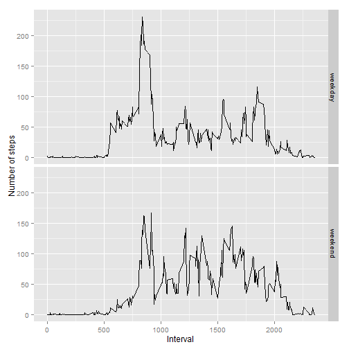

# Reproducible research\Peer assessment 1.
## Very short intro.
I am going to build this document basing on the tasks' text given in 
the Assignment. 

## Loading and preprocessing the data
> Show any code that is needed to  
>
> 1. Load the data (i.e. read.csv())
> 2. Process/transform the data (if necessary) into a format suitable for your analysis

Here I assume that activity.zip file which can be downloaded from repository
is present in the current working directory.
Following code unzips the archive and reads data into a data.frame.
Also I decided to specify a type Date for second column explicitly because
by default it will be converted to a factor.
 

```r
unzip('activity.zip')
activity = read.csv('activity.csv', colClasses = c('integer', 'Date', 'integer'))
str(activity)
```

```
## 'data.frame':	17568 obs. of  3 variables:
##  $ steps   : int  NA NA NA NA NA NA NA NA NA NA ...
##  $ date    : Date, format: "2012-10-01" "2012-10-01" ...
##  $ interval: int  0 5 10 15 20 25 30 35 40 45 ...
```

## What is mean total number of steps taken per day?
> For this part of the assignment, you can ignore the missing values in the 
> dataset.
>
> 1. Calculate the total number of steps taken per day
> 2. If you do not understand the difference between a histogram and a barplot, 
> research the difference between them. Make a histogram of the total number of 
> steps taken each day
> 3. Calculate and report the mean and median of the total number of steps 
> taken per day

I need to summarize steps grouping them by day. I will use dplyr package for
that purpose. And as said in the task I can ignore NAs what means, I suppose,
that I am allowed to not include these rows in the resulted data.frame.


```r
library('dplyr')
totalDayActivity = activity[!is.na(activity$steps),] %>% group_by(date) %>% 
	summarize(totalSteps = sum(steps))
str(totalDayActivity)
```

```
## Classes 'tbl_df', 'tbl' and 'data.frame':	53 obs. of  2 variables:
##  $ date      : Date, format: "2012-10-02" "2012-10-03" ...
##  $ totalSteps: int  126 11352 12116 13294 15420 11015 12811 9900 10304 17382 ...
##  - attr(*, "drop")= logi TRUE
```

```r
head(totalDayActivity)
```

```
## Source: local data frame [6 x 2]
## 
##         date totalSteps
## 1 2012-10-02        126
## 2 2012-10-03      11352
## 3 2012-10-04      12116
## 4 2012-10-05      13294
## 5 2012-10-06      15420
## 6 2012-10-07      11015
```

Just for be sure that all knows the said difference:  
Histogram is a plot of single variable. Here a one should 
break x-axis onto several, usually equal, intervals
and for each interval count the number of times the variable fell into it.
That value is the height of the column standing on the interval. 
The variable here is quantitative  
Barplot is a plot of 2 arguments: one qualitative (goes on x-axis) 
and one quantitative (y-axis). Here for each value of first variable, 
which denotes grouping on second one, a plotting one should count 
the cumulative value of second variable and draw a column of such height.  


Now I will plot a histogram using ggplot2 package:


```r
library('ggplot2')
qplot(totalSteps, data = totalDayActivity, geom = 'histogram', binwidth = 700, 
	main = 'Total number of steps taken each day', 
	xlab = 'Total number of steps', ylab = 'Counts per column base interval')
```

 

Lets find mean and median:


```r
totalStepsMean = mean(totalDayActivity$totalSteps)
totalStepsMedian = median(totalDayActivity$totalSteps)
totalStepsMean
```

```
## [1] 10766.19
```

```r
totalStepsMedian
```

```
## [1] 10765
```

So I've got the mean = 1.0766189 &times; 10<sup>4</sup> and the median = 10765.

## What is the average daily activity pattern?
> 1. Make a time series plot (i.e. type = "l") of the 5-minute interval (x-axis)
> and the average number of steps taken, averaged across all days (y-axis)
> 2. Which 5-minute interval, on average across all the days in the dataset, 
> contains the maximum number of steps?

First I need to get the dataset of the average number of steps per time interval


```r
meanByTimeIntervalActivity = activity[!is.na(activity$steps),] %>% 
	group_by(interval) %>% summarise(meanSteps = mean(steps))
str(meanByTimeIntervalActivity)
```

```
## Classes 'tbl_df', 'tbl' and 'data.frame':	288 obs. of  2 variables:
##  $ interval : int  0 5 10 15 20 25 30 35 40 45 ...
##  $ meanSteps: num  1.717 0.3396 0.1321 0.1509 0.0755 ...
##  - attr(*, "drop")= logi TRUE
```

```r
head(meanByTimeIntervalActivity)
```

```
## Source: local data frame [6 x 2]
## 
##   interval meanSteps
## 1        0 1.7169811
## 2        5 0.3396226
## 3       10 0.1320755
## 4       15 0.1509434
## 5       20 0.0754717
## 6       25 2.0943396
```

And now the plot:


```r
ggplot(meanByTimeIntervalActivity, aes(x = interval, y = meanSteps)) + 
	geom_line() + 
	labs(x = 'The average number of steps taken (averaged across all days)') +
	labs(y = 'The 5-minute intervals') + 
	labs(title = 'Time series of averaged steps\' number per 5-minute interval')
```

 

Lets find maximum:

```r
maximizingTimeInterval = 
	meanByTimeIntervalActivity$interval[meanByTimeIntervalActivity$meanSteps == 
	max(meanByTimeIntervalActivity$meanSteps)]
maximizingTimeIntervalStr = 
	paste(maximizingTimeInterval %/% 100, ':', maximizingTimeInterval %% 100, 
	sep = '')
maximizingTimeIntervalStr
```

```
## [1] "8:35"
```

So the maximum of average number of steps is reached at 
8:35 5-minute time interval.

## Imputing missing values
> Note that there are a number of days/intervals where there are missing values 
> (coded as NA). The presence of missing days may introduce bias into some 
> calculations or summaries of the data.  
>
> 1. Calculate and report the total number of missing values in the dataset 
> (i.e. the total number of rows with NAs)
> 2. Devise a strategy for filling in all of the missing values in the dataset. 
> The strategy does not need to be sophisticated. For example, you could use 
> the mean/median for that day, or the mean for that 5-minute interval, etc.
> 3. Create a new dataset that is equal to the original dataset but with
> the missing data filled in.
> 4. Make a histogram of the total number of steps taken each day and Calculate 
> and report the mean and median total number of steps taken per day. Do these 
> values differ from the estimates from the first part of the assignment? 
> What is the impact of imputing missing data on the estimates of 
> the total daily number of steps?

Lets find how much values are missing:


```r
numberOfMissingVal = sum(is.na(activity$steps))
numberOfMissingVal
```

```
## [1] 2304
```

So in the activity dataset there are 2304 missing values.

For the purpose of setting some value in place of missing values 
I would like to use the mean of steps for all days in the same 5-minute interval
as the missing value.  
But that strategy will be successful only if for each 5-minute interval 
there are at least one non NA value. 
Lets check this by comparing number of distinct intervals of 
the origin activity dataset and the cleaned one which I've got earlier
by throwing away all NA values:


```r
length(levels(factor(activity$interval))) == 
length(levels(factor(meanByTimeIntervalActivity$interval)))
```

```
## [1] TRUE
```

Luckily, all is fine and I can place the average for all days values of steps by 
5-minute interval instead of missing values in that interval (for each interval).
Lets do this:


```r
# Merging two datasets in one. 
# Then I will have for each interval both the original (may be NA) value 
# and the mean value.
newActivity = merge(activity, meanByTimeIntervalActivity,
	by.x = 'interval', by.y = 'interval')
# If the original step value is NA then replace it by the mean value 
newActivity = mutate(newActivity, steps = ifelse(is.na(steps), meanSteps, steps))
# Reordering resulted data.frame for aesthetic purposes by date and interval
newActivity = arrange(newActivity, date, interval)
# Throw away unneeded columns
newActivity = newActivity[, c('interval', 'steps', 'date')]
# Showing results
str(newActivity)
```

```
## 'data.frame':	17568 obs. of  3 variables:
##  $ interval: int  0 5 10 15 20 25 30 35 40 45 ...
##  $ steps   : num  1.717 0.3396 0.1321 0.1509 0.0755 ...
##  $ date    : Date, format: "2012-10-01" "2012-10-01" ...
```

```r
sum(is.na(newActivity$steps)) == 0
```

```
## [1] TRUE
```

Now I need to repeat steps from task 2 but on the renew data.
Namely, I need to make the histogram of total steps per day


```r
totalDayNewActivity = newActivity %>% group_by(date) %>% 
	summarize(totalSteps = sum(steps))
qplot(totalSteps, data = totalDayNewActivity, geom = 'histogram', binwidth = 700, 
	main = 'Total number of steps taken each day', 
	xlab = 'Total number of steps', ylab = 'Counts per column base interval') 	
```

 

And find the new mean and median:


```r
newTotalStepsMean = mean(totalDayNewActivity$totalSteps)
newTotalStepsMedian = median(totalDayNewActivity$totalSteps)
# new values
newTotalStepsMean
```

```
## [1] 10766.19
```

```r
newTotalStepsMedian
```

```
## [1] 10766.19
```

```r
# old values
totalStepsMean
```

```
## [1] 10766.19
```

```r
totalStepsMedian  
```

```
## [1] 10765
```

I would like to estimate theirs difference by looking at 
fraction of the length of difference and the length of there average value.
The less that value the better. 
   

```r
difEst = function(x, y) {
	difference = abs(x - y)
	mean = abs(x + y) / 2
	difference / mean
}
# for the means
difEst(newTotalStepsMean, totalStepsMean)
```

```
## [1] 0
```

```r
# for the medians
difEst(newTotalStepsMedian, totalStepsMedian)
```

```
## [1] 0.0001104146
```

So I can conclude that mean and median almost not changed, 
and this means, at least for these values, estimation of NA values by mean
is unbiased. 


## Are there differences in activity patterns between weekdays and weekends?
> For this part the weekdays() function may be of some help here. 
> Use the dataset with the filled-in missing values for this part.
>
> 1. Create a new factor variable in the dataset 
> with two levels - 'weekday' and 'weekend' indicating whether a given date 
> is a weekday or weekend day.
> 2. Make a panel plot containing a time series plot (i.e. type = "l") of 
> the 5-minute interval (x-axis) and the average number of steps taken, 
> averaged across all weekday days or weekend days (y-axis). 
> See the README file in the GitHub repository to see an example of what this 
> plot should look like using simulated data.

First I want to create a function which will be return 'weekend' or 'weekday'
from the input date:


```r
getWeekFactor = function(date) {
	ifelse(weekdays(date) %in% c('Saturday', 'Sunday'), 'weekend', 'weekday')
}
```

And now I will add a new factor variable to the new dataset:


```r
newActivity = newActivity %>% mutate(weekFactor = getWeekFactor(date))
str(newActivity)
```

```
## 'data.frame':	17568 obs. of  4 variables:
##  $ interval  : int  0 5 10 15 20 25 30 35 40 45 ...
##  $ steps     : num  1.717 0.3396 0.1321 0.1509 0.0755 ...
##  $ date      : Date, format: "2012-10-01" "2012-10-01" ...
##  $ weekFactor: chr  "weekday" "weekday" "weekday" "weekday" ...
```

```r
head(newActivity)
```

```
##   interval     steps       date weekFactor
## 1        0 1.7169811 2012-10-01    weekday
## 2        5 0.3396226 2012-10-01    weekday
## 3       10 0.1320755 2012-10-01    weekday
## 4       15 0.1509434 2012-10-01    weekday
## 5       20 0.0754717 2012-10-01    weekday
## 6       25 2.0943396 2012-10-01    weekday
```

Before making a plot I need to get average values for steps 
by intervals and new factor variable. Average counts among all days.


```r
averagedActivityBy2Groups = newActivity %>%
	group_by(interval, weekFactor) %>% summarize(meanSteps = mean(steps))
str(averagedActivityBy2Groups)
```

```
## Classes 'grouped_df', 'tbl_df', 'tbl' and 'data.frame':	576 obs. of  3 variables:
##  $ interval  : int  0 0 5 5 10 10 15 15 20 20 ...
##  $ weekFactor: chr  "weekday" "weekend" "weekday" "weekend" ...
##  $ meanSteps : num  2.2512 0.2146 0.4453 0.0425 0.1732 ...
##  - attr(*, "vars")=List of 1
##   ..$ : symbol interval
##  - attr(*, "drop")= logi TRUE
```

```r
head(averagedActivityBy2Groups)
```

```
## Source: local data frame [6 x 3]
## Groups: interval
## 
##   interval weekFactor  meanSteps
## 1        0    weekday 2.25115304
## 2        0    weekend 0.21462264
## 3        5    weekday 0.44528302
## 4        5    weekend 0.04245283
## 5       10    weekday 0.17316562
## 6       10    weekend 0.01650943
```

And, finally, the last graphic:


```r
qplot(interval, meanSteps, data = averagedActivityBy2Groups,
	facets = weekFactor ~ ., geom = "line", 
	xlab = 'Interval', ylab = 'Number of steps')
```

 
